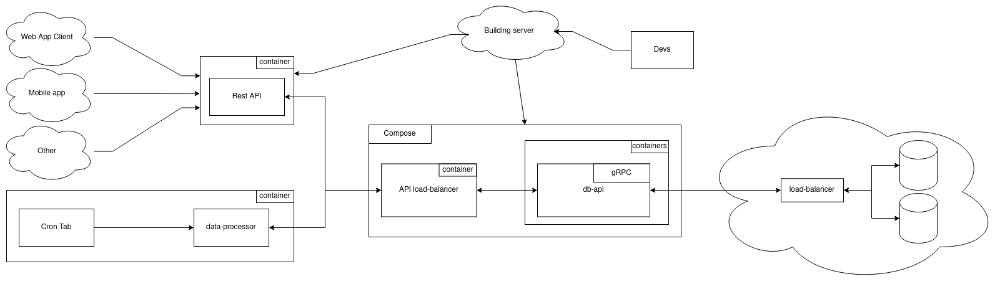
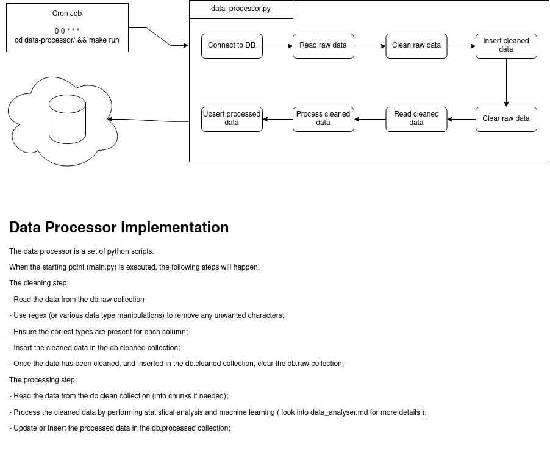

# Big-Data Pipeline



This is a POC for a big-data pipeline.

The pipeline collects students data via different frontned services, process the collected data, and stores it in a NoSQL database.

Currently the pipeline is composed of three main parts:

- **data-processor**
  - used to analyse the collected data, and make statistical analysis
- **web-app**
  - an api that alows clients to interact with the collected data
- **db-api**
  - a middle-end which purpose is to unify the database operations

This documentation shows how the different components interact with each other.

## REST API

To collect the data, the project includes a Rest API with a form and results page.

Being a Rest API, this allows other services to be included later on.

The API is composed of 2 components:

- Client interaction - python3 & [FastAPI](https://github.com/tiangolo/fastapi);

- Database API interaction - gRPC protocol;

FastAPI was chosen because of it's simplicity of use, and easy integration with various security flows offered by OAuth2.

The source code is in the web_app/ folder.

## Data Processing



The data processing part is composed of a set of python scripts which will perform various tasks. These scripts will be executed depending on a cron tab set up in a docker container running a GNU/Linux distribution. When the starting point main.py is executed, the following steps will be executed:

- The cleaning step:

  - Read the data from the db.raw collection.

  - Use regex (or various data type manipulations) to remove any unwanted characters.

  - Ensure the correct types are present for each column.

  - Insert the cleaned data in the db.cleaned collection.

  - Once the data has been cleaned, and inserted in the db.cleaned collection, clear the db.raw collection.

- The processing step:

  - Read the data from the db.clean collection (into chunks if the data is too big).

  - Process the cleaned data by performing statistical analysis and machine learning ( look into data_analyser.md for more details ).

  - Update or Insert the processed data in the db.processed collection.

It's important to note here that the tools used for the processing would rely mainly on the Spark engine, and more specifically it's python implementation - PySpark. Apart from that, there are a few other statistical packages such as statsmodels, scikit-learn, pandas, numpy, and pymongo for database connection and manipulation.

## Database && Database-API

MongoDB was chosen as the NoSQL database.

It offers:

- Flexible schema.

- the JSON types map directly in javascript objects (for the web clients) and python's dictionaries (for the data processor).

- Good drivers support.

- Ability to deploy MongoDB on multiple servers, with several daemons running, to support the pipeline.

Taking all that into concideration and adding the ability to create transactions should be more then enough to handle huge amounts of reading and writing data.

Since the Rest-API and the data-processor both have similar functionalities to communicate with the database, I have chosen to create a seperate api which will be the only one directly interacting with the database.

This can be found in db-api/ folder.

## How to run the project

IMPORTANT: Make sure to fill the missing env variables in the Makefiles, before running the project.

The project has Makefiles for all the 3 services it currently supports.

### To run the db-api:

```
$ cd db-api && make run
```

NOTE: It's important to have db-api running, before the other services, since they rely on it.

### To run the web-app:

```
$ cd web-app && make run
```

### To run the data-processor manullay (currently the only supported way):

```
$ cd data-processor && make run
```
